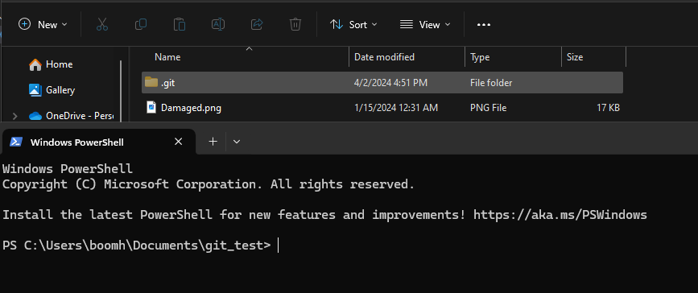

# GIT Version Control ❓
### Git  เป็นระบบจัด Code หรือ Files โดยที่สามารถติดตาม (Log) การเปลีย่นแปลงได้ตลอดเวลา

## Installation 🔧
### เข้าไป Download ที่ https://git-scm.com/downloads ติดตั้งตามปกติ หากต้องการเช็คว่าโหลดแล้วยัง😕 สามารถใช้ Command ผ่าน CMD หรือ Power shell ได้ตามนี้ : `git --version`

## Set up💻
#### 1. สร้าง Folder ขึ้นมาตั้งชื่อตาม Repo ที่จะสร้าง
#### 2. เข้าไปที่ Folder ที่สร้างมาแล้วเปิด Terminal ของ Folder ที่สร้าง

#### 3. ตรวจสอบว่ามี Folder .git ไหมด้วย  Windows command: `ls` หรือเข้าไปที่โฟล์เดอร์โดยตรงได้เลย (บางอันอาจจะเปิดเพื่อดูไฟล์ที่ซ่อนไว้😲) | Mac command: `ls -la` 

## GIT File Lifecycle 🔃 (เกี่ยวกับแค่ภายในเครื่อง)
#### แบ่งออกเป็นหลักๆ ก็ 2 State คือ Untracked และ Staged ก็ให้จำไว้ว่า หากมีไฟล์ใหม่ให้ใช้ Command: `git add .` (ไฟล์ทั้งหมดใน Folder) | `git add ./(filename)` (เฉพาะไฟล์ที่เลือก) เมื่อพอใจแล้วให้ใช้คำสั่ง `git commit -m "[ข้อความกำกับ]: คำอธิบายสั้นๆ"` ก็เป็นอันเสร็จสิ้นจากการเปลี่ยน Untracked เป็น Staged
### หากต้องการตรวจว่ามันเปลี่ยนจริงไหมก็ให้ใช้คำสั่ง `git status`

## GIT Repositories 🏃
#### เกี่ยวกับการสร้าง Repository หรือเรียกสั้นๆว่า Repo เพื่อให้เราสามารถทำงานกับเพื่อนร่วมงานได้สะดวกมากยิ่งขึ้น โดยจะต้องทำคาวมเข้าใจเกี่ยวกับ <spand style ="color:blue">Local</spand> (ในเครื่องของเรา) และ <spand style ="color:red">Remote</spand> (พื้นที่เก็บส่วนกลาง บน Github Gitlab นั่นแหละ) โดยจะมีคำสั่งประมาณนี้
### 1. `git clone https://github.com/example`

## เข้าใช้งานได้ที่
#### <spand style ="color:lightblue"> Git hub: https://github.com/ </spand> |  Git Lab: https://gitlab.com/ 
