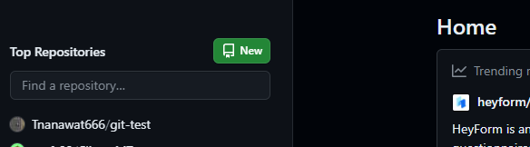

# GIT Version Control ❓
### Git  เป็นระบบจัด Code หรือ Files โดยที่สามารถติดตาม (Log) การเปลีย่นแปลงได้ตลอดเวลา

## Installation 🔧
#### เข้าไป Download ที่ https://git-scm.com/downloads ติดตั้งตามปกติ หากต้องการเช็คว่าโหลดแล้วยัง😕 สามารถใช้ Command ผ่าน CMD หรือ Power shell ได้ตามนี้ 
`git --version` 
#### โหลดมาแล้วจะต้อง Setup git นิดหน่อยโดยใช้คำสั่ง 
`git config --global user.name "ชื่อที่จะใช้"` 

`git config --global user.email "กับอีเมลที่จะใช้"`

## Build up💻
#### 1. สร้าง Folder ขึ้นมา ตั้งชื่อตาม Repo ที่จะสร้าง
#### 2. เข้าไป Folder ที่สร้างมาแล้วเปิด Terminal ของ Folder ที่สร้าง

#### 3. ใช้คำสั่ง `git init` เพื่อให้ git สามารถใช้งานใน Folder นี้ได้
#### 4. ตรวจสอบว่ามี Folder .git ไหมด้วย  Windows command: `ls` หรือเข้าไปที่โฟล์เดอร์โดยตรงได้เลย (บางอันอาจจะเปิดเพื่อดูไฟล์ที่ซ่อนไว้👀) | Mac command: `ls -la` 

## GIT File Lifecycle 🔃 (เกี่ยวกับแค่ภายในเครื่อง)
#### แบ่งออกเป็นหลักๆ ก็ 2 State คือ Untracked และ Staged ก็ให้จำไว้ว่า หากมีไฟล์ใหม่ให้ใช้ Command: 
`git add . (ทั้งหมดใน Folder)` 

`git add ./(filename) (เฉพาะไฟล์ที่เลือก)` 

เมื่อไฟล์ที่ต้องการบันทึกครบแล้วให้ใช้คำสั่ง 
`git commit -m "[ข้อความกำกับ]: คำอธิบายสั้นๆ"` 
ก็เป็นอันเสร็จสิ้นจากการเปลี่ยน Untracked เป็น Staged

หากต้องการตรวจว่ามันเปลี่ยนจริงไหมก็ให้ใช้คำสั่ง `git status`

ถ้าต้องการที่จะลบออกจาก stage ก็ใช้คำสั่ง `git reset` *** ใช้ได้เฉพาะยังไม่ Commit เท่านั้น

## GIT Repositories 🏃
#### เกี่ยวกับการสร้าง Repository หรือเรียกสั้นๆว่า Repo เพื่อให้เราสามารถทำงานกับเพื่อนร่วมงานได้สะดวกมากยิ่งขึ้น โดยจะต้องทำคาวมเข้าใจเกี่ยวกับ Local (ในเครื่องของเรา) และ Remote (พื้นที่เก็บส่วนกลาง บน Github Gitlab นั่นแหละ) 
### How to create repositories ❓
#### ง่ายๆแค่เข้าไปยัง Git repository website ที่ใช้ จะยกตัวอย่างแค่ Github และ Gitlab 
#### Github ลงชื่อเข้าใช้แล้ว ทำการกด New แล้วก็ใส่รายละเอียด  
#### ส่วน Gitlab จะเป็นการสร้าง Project 

## เข้าใช้งานได้ที่ ✅
####  Git hub: https://github.com/  |  Git Lab: https://gitlab.com/ 
    
### โดยจะมีคำสั่งประมาณนี้ 📑
#### 🔵`git clone <URL>` คำสั่งเพื่อ Clone repo ที่มีอยู่แล้ว ตัวอย่าง `git clone https://github.com/example`
#### 🔵`git push <remote> <branch>` เช่น `git push origin main` *** อันนี้ต้องสร้าง Repo มาก่อนนะ
#### 🔵`git pull <remote> <branch> ` เช่น `git pull origin main `
#### 🔵`git branch` แสดงรายชื่อของ Branch ที่มีอยู่
#### 🔵`git checkout <ชื่อ Branch>` ใช้สำหรับสลับ Branch แต่ถ้าเป็นแบบนี้ `git checkout -b <ชื่อ Branch>` คือจะสร้าง Branch ใหม่ และสลับไป Branch ที่พึ่งสร้าง
#### 🔵`git merge <branch>` เป็นการรวม Branch เข้าด้วยกัน เช่น ถ้าต้องการ merge branch features เข้าไปยัง branch dev ให้ทำการ check out ไปที่ branch dev และใช้คำสั่ง `git merge features` ก็จะเป็นการ merge branch features เข้าไปยัง branch dev

### GIT GUI or GIT Extensions VScode (ไม่อยากจำคำสั่ง)😥
#### GIT GUI ที่แนะนำ : 
❤️ Github desktop https://desktop.github.com/ 

❤️ GitKraken https://www.gitkraken.com/ (เสียตังบางส่วน 😰)

❤️ GitFork https://git-fork.com/

#### Git Extensions แนะนำ:
❤️ Git Graph 

❤️ GitLens

### อีกหนึ่งช่องทางก็คือใช้ Jetbrains IDEs https://www.jetbrains.com/ ไปเลย
